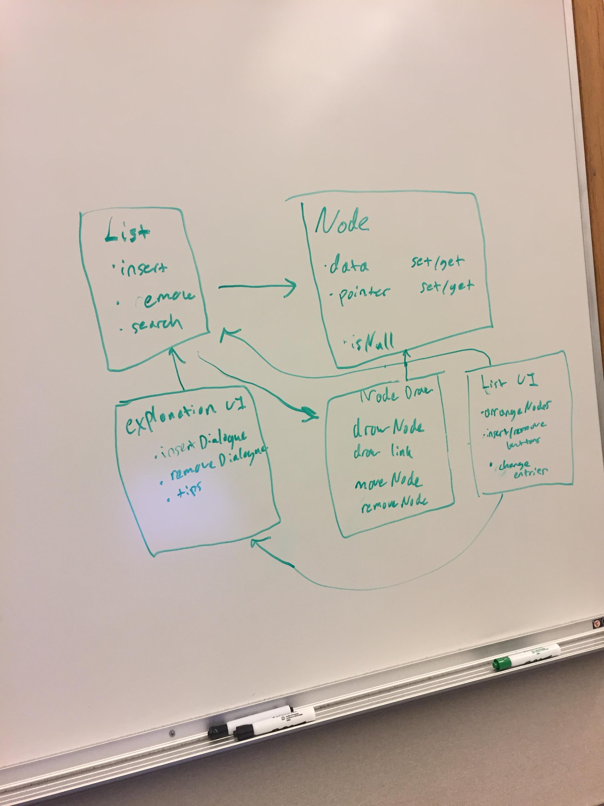
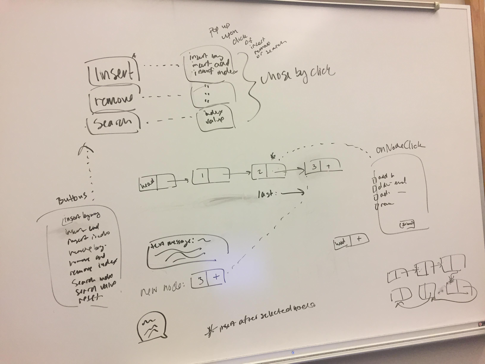

LinkedListVis-SlStMa

Web Apps - Winter 2017

Maggie Kleiman
Stephanie Iglesias
Slaton Blickman

<b>Modules</b>

<b>Plan</b>

Questions:
1.) How do we want the LinkedList visual to look?
2.) HOW DO WE USE SVG GRAPHICS?????
3.) How do we get the graphics to move? (Animation)
4.) If we have to insert a node in the middle, how are we going to shift all the other nodes?
5.) Decide on how we want to arrange our buttons. Buttons for all the different inserts/removes.
6.) Figure out the selected of a node by clicking on it.
7.) Linking the text bubbles to the different functions.
8.) How do we set up our own testing files?
